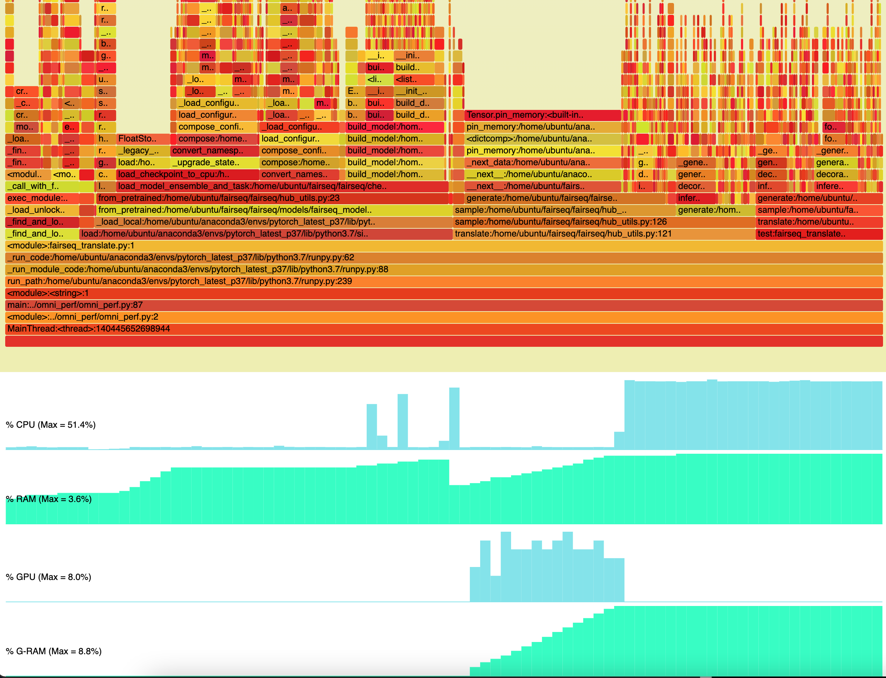

# omni_perf

omni_perf combines system-wide activities (CPU and CPU memory utilization; GPU and GPU memory untilization if available) logging with sampling-based call stack profiling of a Python script into a single flame-chart style display.  It uses [pyinstrument](https://github.com/joerick/pyinstrument) for profiling, [psutil](https://github.com/giampaolo/psutil) and [pynvml](https://github.com/gpuopenanalytics/pynvml) for reading system activities, [drawSvg](https://github.com/cduck/drawSvg) and [svg-stack](https://github.com/astraw/svg_stack) for SVG manipulation, and [pyinstrument-flame](https://pypi.org/project/pyinstrument-flame/) for exporting flame charts.

## Install dependencies

    pip install -r requirements.txt

## Usage

    python omni_perf.py --help
    usage: omni_perf.py [-h] [-o OUTPUT] [--prof_interval PROF_INTERVAL] [--sys_interval SYS_INTERVAL] script

    positional arguments:
    script                python script to profile

    optional arguments:
    -h, --help            show this help message and exit
    -o OUTPUT, --output OUTPUT
                            output file name without extension (default: perf_output)
    --prof_interval PROF_INTERVAL
                            profiler sampling interval (default: 1000 samples/seconcd)
    --sys_interval SYS_INTERVAL
                            system activity sampling interval (default: 1 sample/seconcd)

The results (`perf_output.svg` and `perf_output.html` if output name is not set with `--output` or `-o`) can be opened in a web browser.  Below is an  example output flame chart:

