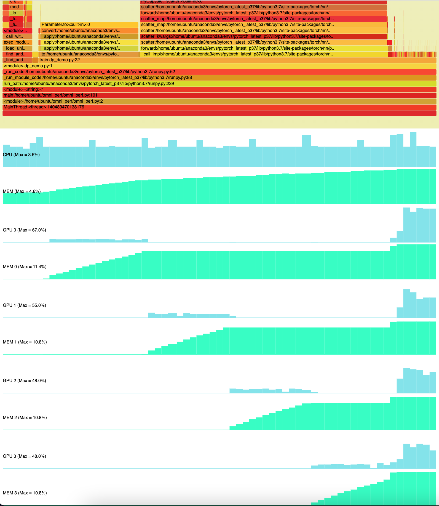
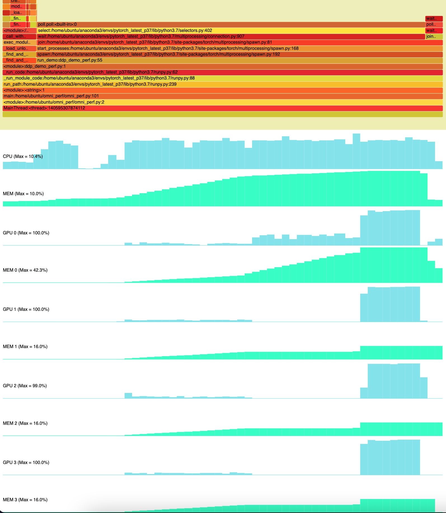

# omni_perf

omni_perf combines system-wide activities (CPU and CPU memory utilization; GPU and GPU memory untilization if available) logging with sampling-based call stack profiling of a Python script into a single flame-chart style display.  It is intended to be used as a first step high-level overview of the duration of the entire run, to facilitate identifying hotspots that can be further studied with precision tools such as the PyTorch Profiler in greater detail.  Under the hood it uses [pyinstrument](https://github.com/joerick/pyinstrument) for profiling, [psutil](https://github.com/giampaolo/psutil) and [pynvml](https://github.com/gpuopenanalytics/pynvml) for reading system activities, [drawSvg](https://github.com/cduck/drawSvg) and [svg-stack](https://github.com/astraw/svg_stack) for SVG manipulation, and [pyinstrument-flame](https://pypi.org/project/pyinstrument-flame/) for exporting flame charts.  

## Install dependencies

    pip install -r requirements.txt

Note: currently omni_perf has only been tested on Ubuntu/Linux.

## Usage

    Usage: python omni_perf.py [options] scriptfile [arg] ...

    Options:
    --version             show program's version number and exit
    -h, --help            show this help message and exit
    -o OUTPUT, --output=OUTPUT
                            output file name without extension (default: perf_output)
    -p PROF_INTERVAL, --prof_interval=PROF_INTERVAL
                            profiler sampling interval (default: 1000 samples/seconcd)
    -s SYS_INTERVAL, --sys_interval=SYS_INTERVAL
                            system activity sampling interval (default: 1 sample/seconcd)

The results (`perf_output.svg` and `perf_output.html` if output name is not set with `--output` or `-o`) can be opened in a web browser.  Below is an  example output flame chart:

## More examples
The two examples below were run on an AWS g4dn.12xlarge instance with 4 Nvidia T4 GPUs.  The serial data copy pattern of DataParallel is obvious on GPU utilization sequence.

### PyTorch DataParallel multi GPU training
    python omni_perf.py -s 0.25 -o dp_output examples/pytorch_train_dp.py

### PyTorch DistributedDataParallel multi GPU training
    python omni_perf.py -s 0.25 -o dp_output examples/pytorch_train_ddp.py

